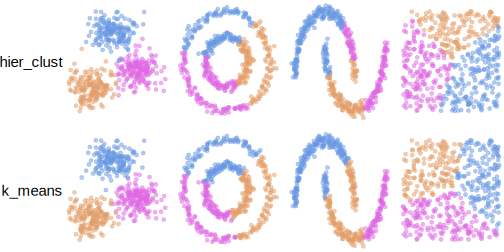

<!-- README.md is generated from README.Rmd. Please edit that file -->

# tidyclust 

<!-- badges: start -->

[](https://app.codecov.io/gh/tidymodels/tidyclust?branch=main)
[](https://github.com/tidymodels/tidyclust/actions/workflows/R-CMD-check.yaml)
<!-- badges: end -->

The goal of tidyclust is to provide a tidy, unified interface to
clustering models. The packages is closely modeled after the
[parsnip](https://parsnip.tidymodels.org/) package.

## Installation

You can install the released version of tidyclust from
[CRAN](https://CRAN.R-project.org) with:

``` r
install.packages("tidyclust")
```

and the development version of tidyclust from
[GitHub](https://github.com/) with:

``` r
# install.packages("pak")
pak::pak("tidymodels/tidyclust")
```

## Example

The first thing you do is to create a `cluster specification`. For this
example we are creating a K-means model, using the `stats` engine.

``` r
library(tidyclust)
set.seed(1234)

kmeans_spec <- k_means(num_clusters = 3) |>
  set_engine("stats")

kmeans_spec
#> K Means Cluster Specification (partition)
#> 
#> Main Arguments:
#>   num_clusters = 3
#> 
#> Computational engine: stats
```

This specification can then be fit using data.

``` r
kmeans_spec_fit <- kmeans_spec |>
  fit(~., data = mtcars)
kmeans_spec_fit
#> tidyclust cluster object
#> 
#> K-means clustering with 3 clusters of sizes 7, 11, 14
#> 
#> Cluster means:
#>        mpg cyl     disp        hp     drat       wt     qsec        vs
#> 1 19.74286   6 183.3143 122.28571 3.585714 3.117143 17.97714 0.5714286
#> 3 26.66364   4 105.1364  82.63636 4.070909 2.285727 19.13727 0.9090909
#> 2 15.10000   8 353.1000 209.21429 3.229286 3.999214 16.77214 0.0000000
#>          am     gear     carb
#> 1 0.4285714 3.857143 3.428571
#> 3 0.7272727 4.090909 1.545455
#> 2 0.1428571 3.285714 3.500000
#> 
#> Clustering vector:
#>           Mazda RX4       Mazda RX4 Wag          Datsun 710      Hornet 4 Drive 
#>                   1                   1                   2                   1 
#>   Hornet Sportabout             Valiant          Duster 360           Merc 240D 
#>                   3                   1                   3                   2 
#>            Merc 230            Merc 280           Merc 280C          Merc 450SE 
#>                   2                   1                   1                   3 
#>          Merc 450SL         Merc 450SLC  Cadillac Fleetwood Lincoln Continental 
#>                   3                   3                   3                   3 
#>   Chrysler Imperial            Fiat 128         Honda Civic      Toyota Corolla 
#>                   3                   2                   2                   2 
#>       Toyota Corona    Dodge Challenger         AMC Javelin          Camaro Z28 
#>                   2                   3                   3                   3 
#>    Pontiac Firebird           Fiat X1-9       Porsche 914-2        Lotus Europa 
#>                   3                   2                   2                   2 
#>      Ford Pantera L        Ferrari Dino       Maserati Bora          Volvo 142E 
#>                   3                   1                   3                   2 
#> 
#> Within cluster sum of squares by cluster:
#> [1] 13954.34 11848.37 93643.90
#>  (between_SS / total_SS =  80.8 %)
#> 
#> Available components:
#> 
#> [1] "cluster"      "centers"      "totss"        "withinss"     "tot.withinss"
#> [6] "betweenss"    "size"         "iter"         "ifault"
```

Once you have a fitted tidyclust object, you can do a number of things.
`predict()` returns the cluster a new observation belongs to

``` r
predict(kmeans_spec_fit, mtcars[1:4, ])
#> # A tibble: 4 × 1
#>   .pred_cluster
#>   <fct>        
#> 1 Cluster_1    
#> 2 Cluster_1    
#> 3 Cluster_2    
#> 4 Cluster_1
```

`extract_cluster_assignment()` returns the cluster assignments of the
training observations

``` r
extract_cluster_assignment(kmeans_spec_fit)
#> # A tibble: 32 × 1
#>    .cluster 
#>    <fct>    
#>  1 Cluster_1
#>  2 Cluster_1
#>  3 Cluster_2
#>  4 Cluster_1
#>  5 Cluster_3
#>  6 Cluster_1
#>  7 Cluster_3
#>  8 Cluster_2
#>  9 Cluster_2
#> 10 Cluster_1
#> # ℹ 22 more rows
```

and `extract_centroids()` returns the locations of the clusters

``` r
extract_centroids(kmeans_spec_fit)
#> # A tibble: 3 × 12
#>   .cluster    mpg   cyl  disp    hp  drat    wt  qsec    vs    am  gear  carb
#>   <fct>     <dbl> <dbl> <dbl> <dbl> <dbl> <dbl> <dbl> <dbl> <dbl> <dbl> <dbl>
#> 1 Cluster_1  19.7     6  183. 122.   3.59  3.12  18.0 0.571 0.429  3.86  3.43
#> 2 Cluster_2  26.7     4  105.  82.6  4.07  2.29  19.1 0.909 0.727  4.09  1.55
#> 3 Cluster_3  15.1     8  353. 209.   3.23  4.00  16.8 0     0.143  3.29  3.5
```

## Visual comparison of clustering methods

Below is a visualization of the available models and how they compare
using 2 dimensional toy data sets.



## Contributing

This project is released with a [Contributor Code of
Conduct](https://contributor-covenant.org/version/2/0/CODE_OF_CONDUCT.html).
By contributing to this project, you agree to abide by its terms.

- For questions and discussions about tidymodels packages, modeling, and
  machine learning, please [post on RStudio
  Community](https://forum.posit.co/new-topic?category_id=15&tags=tidymodels,question).

- If you think you have encountered a bug, please [submit an
  issue](https://github.com/tidymodels/tidyclust/issues).

- Either way, learn how to create and share a
  [reprex](https://reprex.tidyverse.org/articles/articles/learn-reprex.html)
  (a minimal, reproducible example), to clearly communicate about your
  code.

- Check out further details on [contributing guidelines for tidymodels
  packages](https://www.tidymodels.org/contribute/) and [how to get
  help](https://www.tidymodels.org/help/). Footer
