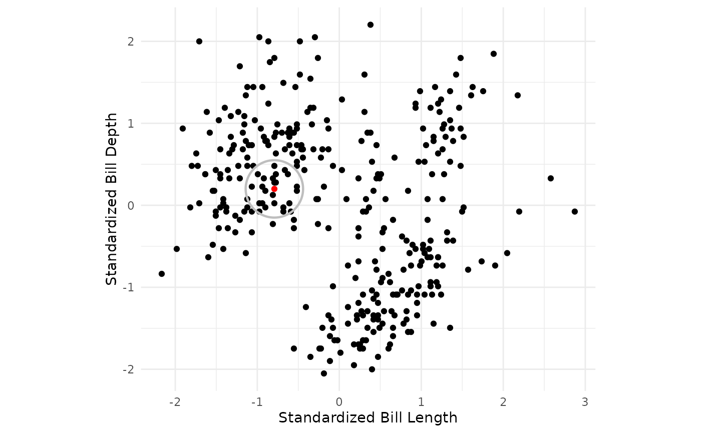
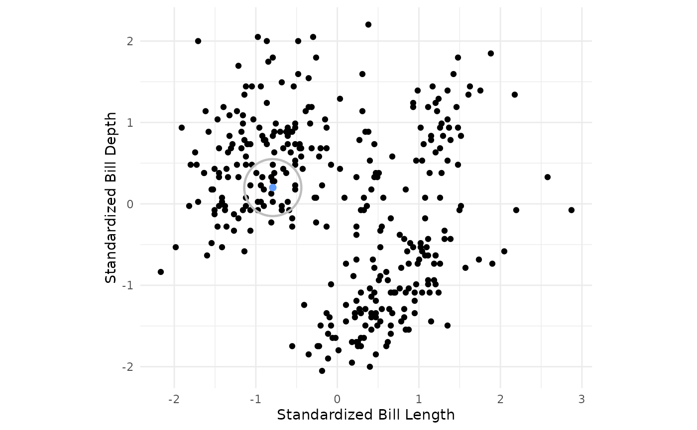
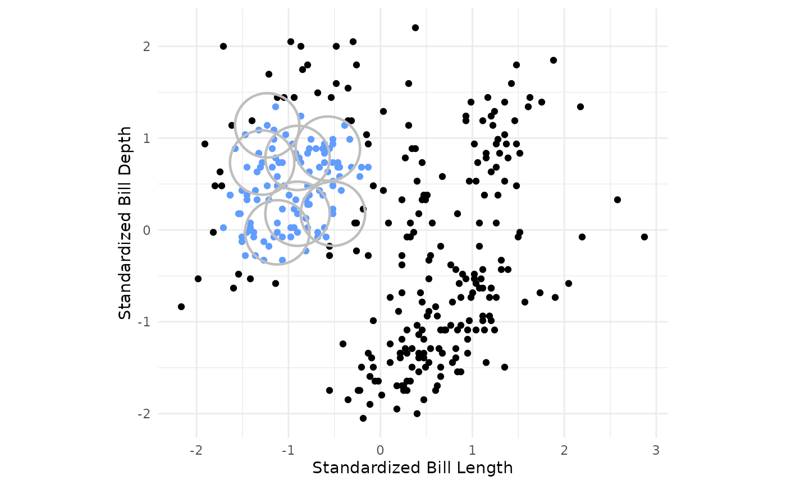
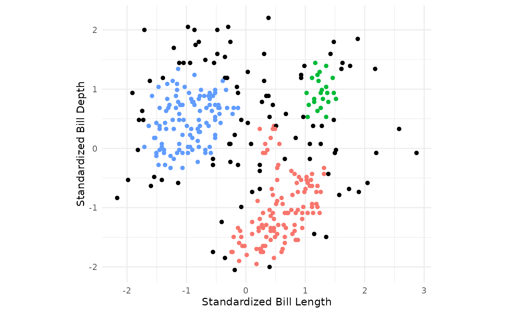
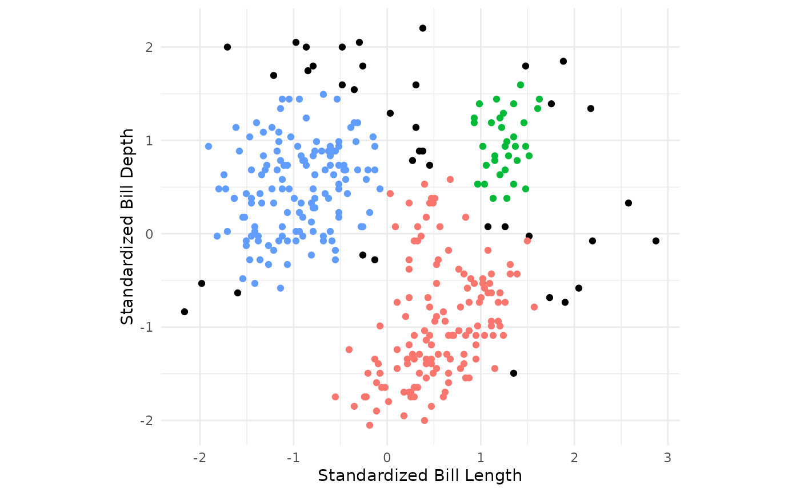

# Density-Based Clustering

## Setup

``` r

library(workflows)
library(parsnip)
```

Load libraries:

``` r

library(tidyclust)
library(tidyverse)
library(tidymodels)
```

Load and clean a dataset:

``` r

data("penguins", package = "modeldata")

penguins <- penguins %>%
  select(bill_length_mm, bill_depth_mm) %>%
  drop_na()

# shuffle rows
penguins <- penguins %>%
  sample_n(nrow(penguins))
```

At the end of this vignette, you will find a brief overview of the
DBSCAN algorithm.

## `db_clust` specification in {`tidyclust`}

To specify a DBSCAN model in `tidyclust`, simply set the values for
`radius` and `min_pts`:

``` r

db_clust_spec <- db_clust(radius = 0.35, min_points = 10)

db_clust_spec
#> DBSCAN Clustering Specification (partition)
#> 
#> Main Arguments:
#>   radius = 0.35
#>   min_points = 10
#> 
#> Computational engine: dbscan
```

There is currently one engine:
[`dbscan::dbscan`](https://rdrr.io/pkg/dbscan/man/dbscan.html) (default)

## Fitting db_clust models

After specifying the model specification, we fit the model to data in
the usual way:

Note that I have standardized bill length and bill depth since DBSCAN
uses euclidean distance to fit clusters and these variables are on
different scales.

``` r


penguins_recipe <- recipe(~bill_length_mm + bill_depth_mm, data = penguins) %>%
  step_normalize(all_numeric_predictors())

db_workflow <- workflow() %>%
  add_model(db_clust_spec) %>%
  add_recipe(penguins_recipe)

db_clust_fit <- db_workflow %>%
  fit(data = penguins)

db_clust_fit %>% 
  summary()
#>         Length Class      Mode   
#> pre     3      stage_pre  list   
#> fit     2      stage_fit  list   
#> post    2      stage_post list   
#> trained 1      -none-     logical
```

We can also extract the standard `tidyclust` summary list:

``` r

db_clust_summary <- db_clust_fit %>% extract_fit_summary()

db_clust_summary %>% str()
#> List of 7
#>  $ cluster_names         : Factor w/ 4 levels "Outlier","Cluster_1",..: 1 2 3 4
#>  $ centroids             : tibble [4 × 2] (S3: tbl_df/tbl/data.frame)
#>   ..$ bill_length_mm: num [1:4] NA 0.555 -0.957 1.251
#>   ..$ bill_depth_mm : num [1:4] NA -0.958 0.493 0.964
#>  $ n_members             : int [1:4] 38 135 136 33
#>  $ sse_within_total_total: num [1:4] 92.6 80.4 11.3 NA
#>  $ sse_total             : num 455
#>  $ orig_labels           : NULL
#>  $ cluster_assignments   : Factor w/ 4 levels "Outlier","Cluster_1",..: 2 2 3 2 3 2 3 2 2 4 ...
```

## Cluster assignments and centers

The cluster assignments for the training data can be accessed using the
[`extract_cluster_assignment()`](https://tidyclust.tidymodels.org/dev/reference/extract_cluster_assignment.md)
function.

Note that the DBSCAN algorithm allows for some points to not be assigned
clusters. These points are labeled as outliers.

``` r

db_clust_fit %>% extract_cluster_assignment()
#> # A tibble: 342 × 1
#>    .cluster 
#>    <fct>    
#>  1 Cluster_1
#>  2 Cluster_1
#>  3 Cluster_2
#>  4 Cluster_1
#>  5 Cluster_2
#>  6 Cluster_1
#>  7 Cluster_2
#>  8 Cluster_1
#>  9 Cluster_1
#> 10 Cluster_3
#> # ℹ 332 more rows
```

### Centroids

While the centroids produced by a db_clust fit may not be of primary
interest, they can still be accessed via the
[`extract_fit_summary()`](https://tidyclust.tidymodels.org/dev/reference/extract_fit_summary.md)
object.

``` r

db_clust_fit %>% extract_centroids()
#> # A tibble: 4 × 3
#>   .cluster  bill_length_mm bill_depth_mm
#>   <fct>              <dbl>         <dbl>
#> 1 Outlier           NA            NA    
#> 2 Cluster_1          0.555        -0.958
#> 3 Cluster_2         -0.957         0.493
#> 4 Cluster_3          1.25          0.964
```

## Prediction

Since $`DBSCAN`$ algorithm ultimately assigns training observations to
the clusters based on proximity to core points, it is natural to
“predict” that test observations belong to a cluster if they are within
`radius` distance to a core point. To reconcile points being within the
radius of two core points that belong to different clusters, the
[`predict()`](https://rdrr.io/r/stats/predict.html) function assigns new
observations to the cluster of the closest core point. If a point is not
within the `radius` of any core points, it is predicted to be an
outlier.

``` r

new_penguin <- tibble(
  bill_length_mm = 45,
  bill_depth_mm = 15
)

db_clust_fit %>%
  predict(new_penguin)
#> # A tibble: 1 × 1
#>   .pred_cluster
#>   <fct>        
#> 1 Cluster_1
```

## A brief introduction to density-based clustering

Density-Based Spatial Clustering of Applications with Noise (DBSCAN) is
a method of unsupervised learning that groups observations into clusters
based on their density in multidimensional space. Unlike methods such as
k-means, DBSCAN does not require specifying the number of clusters
beforehand and can identify clusters of arbitrary shapes. Additionally,
it can classify points that do not belong to any cluster as outliers,
allowing for greater flexibility in handling real-world data.

In DBSCAN, observations are considered as locations in multidimensional
space. The algorithm works by defining a cluster as a dense region of
connected points. During the fitting process, points are classified as
core points, border points, or noise based on their proximity to other
points (**radius**) and a density threshold (**min_points**).

The fitting process can be described as follows:

1.  Begin scanning the dataset for core points. A core point is defined
    as an observation which has more than the specified **min_points**
    points (including the point itself) within the specified **radius**
    around the point.



2.  If a core point is found, form a cluster with the core point and
    begin recursively building out the cluster to nearby core points.

``` r


penguins_std %>%
  ggplot() +
  geom_point(aes(x = bill_length_std, y = bill_depth_std)) +
  theme_minimal() +
  geom_circle(tibble(x = c(-0.79162259), y = c(0.2), radius = rep(eps,1)),
              mapping = aes(x0 = x, y0 = y, r = eps),
              color = "gray", linewidth = 0.8) +
  geom_point(tibble(x = c(-0.79162259), y = c(0.2)), mapping = aes(x = x, y = y, color = c("1")), size = 2) +
  coord_fixed() +
  theme(legend.position = "none") +
  scale_color_manual(values = c("#619CFF"))+
labs(x = "Standardized Bill Length", y = "Standardized Bill Depth")
```



3.  For every other point within the specified **radius** of the core
    point, search for other core points to add to the cluster. For every
    core point added, recursively search for core points within
    **radius** distance of any core point added until core points for
    the single cluster have been found.

``` r

penguins_new <- penguins_std
penguins_new$cluster <- (db_clust_fit %>% extract_cluster_assignment())$.cluster
# factor(dbscan_fit$cluster)
penguins_new$cp2 <- factor(if_else(as.numeric(is.corepoint(penguins_std, eps = eps, minPts = min_points)) == 1 & penguins_new$cluster == "Cluster_2", "Yes", "No"), levels = c("Yes", "No"))

penguins_new$radius <- if_else(penguins_new$cp2 == "Yes", eps, 0)

penguins_new_sub <- penguins_new %>% filter(cp2 == "Yes") %>%
  .[c(2,3,4,5,7,9,16),]

penguins_new %>%
  ggplot(aes(x = bill_length_std, y = bill_depth_std, color = cp2)) +
  geom_point() +
  theme_minimal() +
  geom_circle(mapping = aes(x0 = bill_length_std, y0 = bill_depth_std, r = radius), color = "gray", linewidth = 0.8, data = penguins_new_sub) +
  coord_fixed() +
  scale_color_manual(values = c("#619CFF", "black")) +
  theme(legend.position = "none")+
labs(x = "Standardized Bill Length", y = "Standardized Bill Depth")
```



4.  Repeat the previous steps until all core points for every cluster
    have been identified.



5.  For the remaining points not assigned to a cluster, check whether
    the point is within the radius of a core point and assign to cluster
    corresponding to nearest core point. Points not in the radius of any
    core points, are considered outliers.


