# Gaussian Model Clustering

## Setup

``` r
library(workflows)
library(parsnip)
```

Load Libraries:

``` r
library(tidyclust)
library(tidyverse)
library(tidymodels)
library(mclust)
```

Load and clean a dataset:

``` r
data("penguins", package = "modeldata")

penguins <- penguins %>%
  select(bill_length_mm, bill_depth_mm) %>%
  drop_na()


# shuffle rows
penguins <- penguins %>%
  sample_n(nrow(penguins))
```

At the end of this vignette, you will find a brief overview of the GMM
algorithm and examples of each GMM model specification.

## `gm_clust` specification in {`tidyclust`}

To specify a GMM model in `tidyclust`, set the value for `num_clusters`
and use the TRUE/FALSE parameters to select which model specification to
use:

``` r
gm_clust_spec <- gm_clust(
  num_clusters = 3,
  circular = FALSE,
  zero_covariance = FALSE,
  shared_orientation = TRUE,
  shared_shape = FALSE,
  shared_size = FALSE
)

gm_clust_spec
#> GMM Clustering Specification (partition)
#> 
#> Main Arguments:
#>   num_clusters = 3
#>   circular = FALSE
#>   zero_covariance = FALSE
#>   shared_orientation = TRUE
#>   shared_shape = FALSE
#>   shared_size = FALSE
#> 
#> Computational engine: mclust
```

There is currently one engine:
[`mclust::Mclust`](https://mclust-org.github.io/mclust/reference/Mclust.html)
(default)

## Fitting gm_clust models

After specifying the model specification, we fit the model to data in
the usual way:

``` r
gm_clust_fit <- gm_clust_spec %>%
  fit( ~ bill_length_mm + bill_depth_mm,
       data = penguins
      )

gm_clust_fit %>% 
  summary()
#>         Length Class    Mode
#> spec     4     gm_clust list
#> fit     16     Mclust   list
#> elapsed  1     -none-   list
#> preproc  4     -none-   list
```

We can also extract the standard `tidyclust` summary list:

``` r
gm_clust_summary <- gm_clust_fit %>% extract_fit_summary()

gm_clust_summary %>% str()
#> List of 7
#>  $ cluster_names         : Factor w/ 3 levels "Cluster_1","Cluster_2",..: 1 2 3
#>  $ centroids             : tibble [3 × 2] (S3: tbl_df/tbl/data.frame)
#>   ..$ bill_length_mm: num [1:3] 47.6 38.8 48.9
#>   ..$ bill_depth_mm : num [1:3] 15 18.3 18.5
#>  $ n_members             : int [1:3] 122 153 67
#>  $ sse_within_total_total: num [1:3] 328 385 186
#>  $ sse_total             : num 1803
#>  $ orig_labels           : NULL
#>  $ cluster_assignments   : Factor w/ 3 levels "Cluster_1","Cluster_2",..: 1 1 2 1 2 1 2 1 1 3 ...
```

## Cluster assignments and centers

The cluster assignments for the training data can be accessed using the
[`extract_cluster_assignment()`](https://tidyclust.tidymodels.org/dev/reference/extract_cluster_assignment.md)
function.

``` r
gm_clust_fit %>% extract_cluster_assignment()
#> # A tibble: 342 × 1
#>    .cluster 
#>    <fct>    
#>  1 Cluster_1
#>  2 Cluster_1
#>  3 Cluster_2
#>  4 Cluster_1
#>  5 Cluster_2
#>  6 Cluster_1
#>  7 Cluster_2
#>  8 Cluster_1
#>  9 Cluster_1
#> 10 Cluster_3
#> # ℹ 332 more rows
```

If you have not yet read the `k_means` vignette, we recommend reading
that first; functions that are used in this vignette are explained in
more detail there.

### Centroids

The centroids for the fitted clusters can be accessed via
[`extract_centroids()`](https://tidyclust.tidymodels.org/dev/reference/extract_centroids.md):

``` r
gm_clust_fit %>% extract_centroids()
#> # A tibble: 3 × 3
#>   .cluster  bill_length_mm bill_depth_mm
#>   <fct>              <dbl>         <dbl>
#> 1 Cluster_1           47.6          15.0
#> 2 Cluster_2           38.8          18.3
#> 3 Cluster_3           48.9          18.5
```

## Prediction

For GMMs each cluster is modeled as a multivariate normal distribution.
This makes prediction easy since we can calculate the probability that
each point belongs to each of the fitted clusters. Therefore, it is
natural for the [`predict()`](https://rdrr.io/r/stats/predict.html)
function to assign new observations to the cluster in which they have
the highest probability of belonging to.

``` r
new_penguin <- tibble(
  bill_length_mm = 40,
  bill_depth_mm = 20
)

gm_clust_fit %>%
  predict(new_penguin)
#> # A tibble: 1 × 1
#>   .pred_cluster
#>   <fct>        
#> 1 Cluster_2
```

## Gaussian Mixture Model Specifications

| Model Name | Circular Clusters? | Zero Covariance? | Shared Orientation? | Shared Shape? | Shared Size? | Example                 |
|------------|--------------------|------------------|---------------------|---------------|--------------|-------------------------|
| EII        | TRUE               | –                | –                   | –             | TRUE         |  |
| VII        | TRUE               | –                | –                   | –             | FALSE        |  |
| EEI        | FALSE              | TRUE             | –                   | TRUE          | TRUE         | 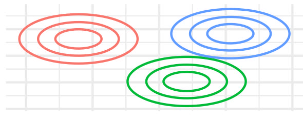 |
| EVI        | FALSE              | TRUE             | –                   | FALSE         | TRUE         | 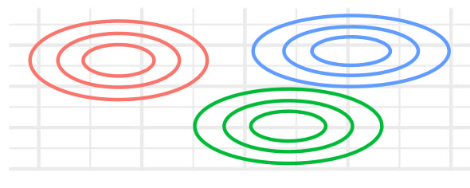 |
| VEI        | FALSE              | TRUE             | –                   | TRUE          | FALSE        | 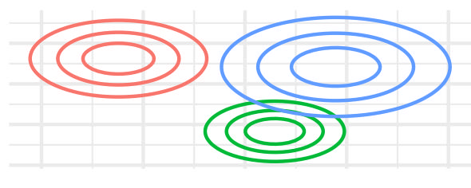 |
| VVI        | FALSE              | TRUE             | –                   | FALSE         | FALSE        | 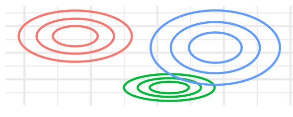 |
| EEE        | FALSE              | FALSE            | TRUE                | TRUE          | TRUE         | 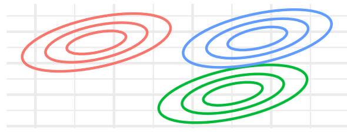 |
| EVE        | FALSE              | FALSE            | TRUE                | FALSE         | TRUE         | 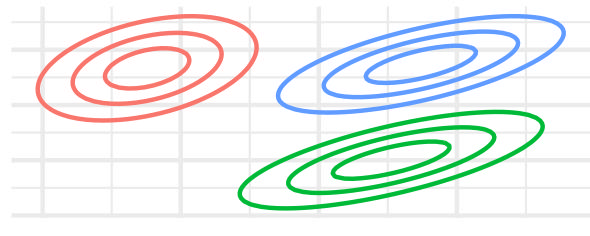 |
| VEE        | FALSE              | FALSE            | TRUE                | TRUE          | FALSE        | 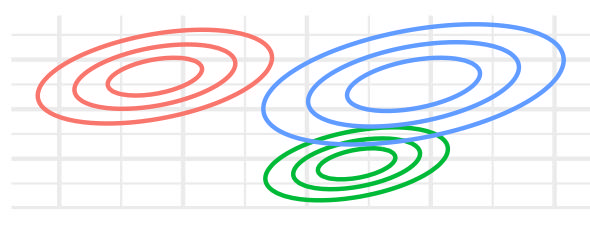 |
| VVE        | FALSE              | FALSE            | TRUE                | FALSE         | FALSE        | 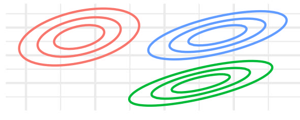 |
| EEV        | FALSE              | FALSE            | FALSE               | TRUE          | TRUE         | 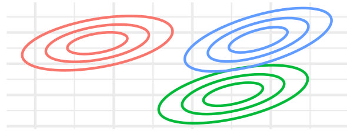 |
| EVV        | FALSE              | FALSE            | FALSE               | FALSE         | TRUE         | 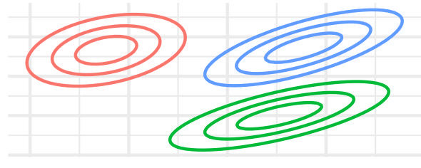 |
| VEV        | FALSE              | FALSE            | FALSE               | TRUE          | FALSE        | 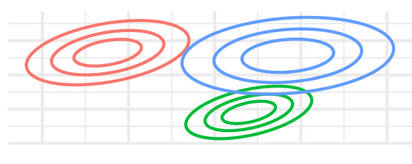 |
| VVV        | FALSE              | FALSE            | FALSE               | FALSE         | FALSE        | 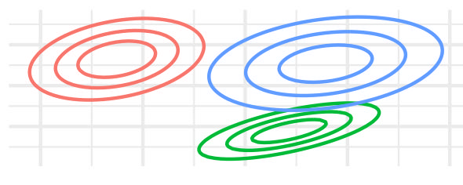 |

GMM Model Specifications with gm_clust()

## A brief introduction to density-based clustering

Gaussian Mixture Models (GMM) is a probabilistic unsupervised learning
method that models data as a mixture of multiple Gaussian distributions.
Unlike clustering methods such as k-means, GMM provides a soft
clustering approach, where each observation has a probability of
belonging to multiple clusters. This allows for more flexibility in
capturing complex data distributions.

In GMM, observations are assumed to be generated from a combination of
Gaussian distributions, each with some mean vector and
variance-covariance matrix. The algorithm works by iteratively
estimating these parameters for each cluster using the
Expectation-Maximization (EM) algorithm. After estimating these
parameters observations are assigned to clusters based on their
probability of belonging to each Gaussian component.

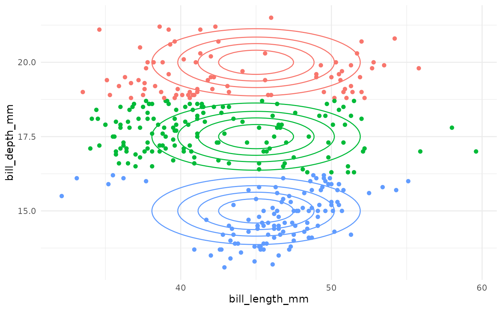

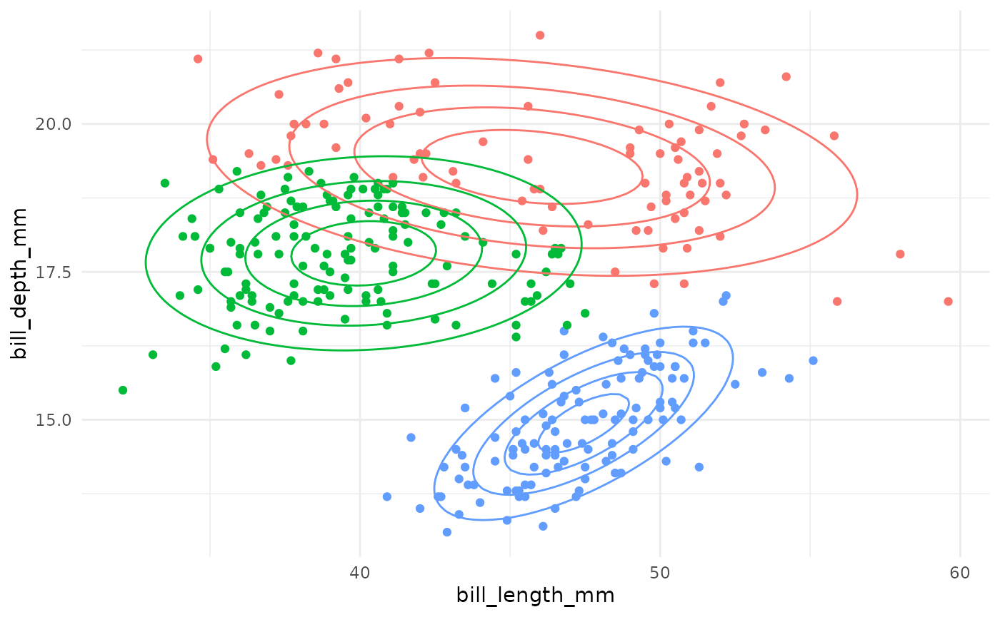

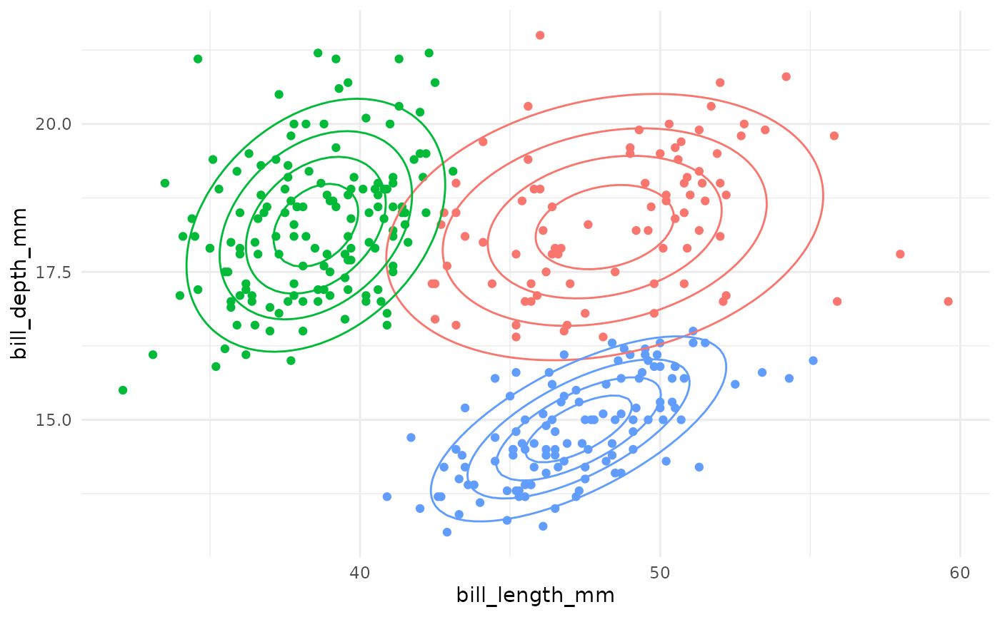

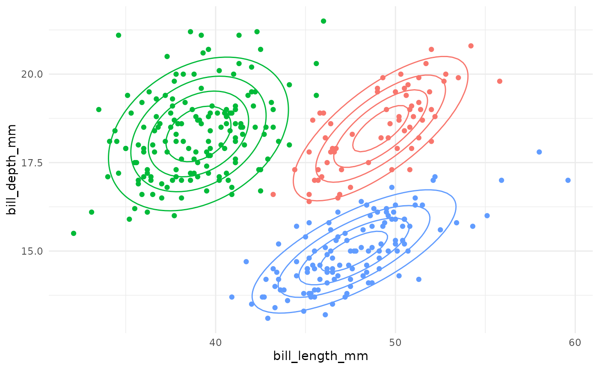
